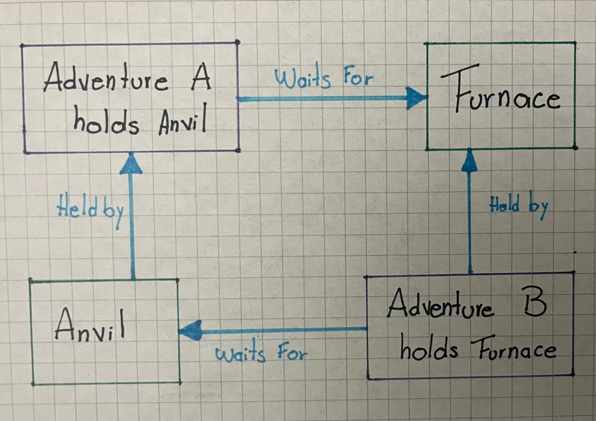

# ARSW Lab 3 - Relic Rush - Delivery Report

## Team

| Student                         | ID | GitHub |
|---------------------------------|---|---|
| KEVYN DANIEL FORERO GONZALEZ    | 1000095428|kevyn1005 |
| MARIA JULIANA RODRIGUEZ CAICECO |1000095732 |JuliRodC|
| HEVER BARRERA BATERO            | 1000094509|heverthisday |

Repository: `https://github.com/kevyn1005/lab3-arsw-relic-rush-concurrency-deadlocks.git`

Final commit: `SHA`

## 1. Baseline observations

- Command(s) executed:
>java -cp target/classes edu.eci.arsw.relicrush.app.LedgerRaceProbe 64 5000

>java -cp target/classes edu.eci.arsw.relicrush.app.RelicRushMain
- What happened?
> LedgerRaceProbe lost most of the writes it was supposed to record: out of 320000 expected updates (64 threads × 5000 writes), only 7468 made it into totalCrafted, and 305989 into the event list. Running RelicRushMain printed invariant=BROKEN starting from round 1, and since LockPair still had the unordered locking bug at the same time, most runs simply froze and got killed by the game's own watchdog before finishing
- Was the round invariant always preserved?
> No, not even once we let it run for more than a couple of rounds. Any time the race window in ForgeLedger.record got hit, scoreSum, ledger.totalCrafted(), and events.size() stopped matching each other
- Did the game stop unexpectedly?
> Yes, in most attempts. GameEngine.startDeadlockWatchdog detected a real JVM deadlock through ThreadMXBean.findDeadlockedThreads() and called System.exit(2) well before the 25 rounds were completed.
Evidence:

```text
PS C:\Users\Kevyn\Desktop\9 semestre\ARSW repos\Lab03> java -cp target/classes edu.eci.arsw.relicrush.app.LedgerRaceProbe
expected=64000 totalCrafted=2851 eventCount=55562 invariant=BROKEN

PS C:\Users\Kevyn\Desktop\9 semestre\ARSW repos\Lab03> java -cp target/classes edu.eci.arsw.relicrush.app.LedgerRaceProbe 64 5000
expected=320000 totalCrafted=6304 eventCount=285686 invariant=BROKEN

```

## 2. Coordination analysis

Explain the responsibility of both barriers:

- `roundStart`:It ensures that no adventurer starts round N until everyone, including the coordinator, has reached that point. This prevents one thread from starting early while others are still finishing the previous round or the coordinator is still reading the previous snapshot. In this way, the barrier makes sure that all threads start the new round at the same time.
- `roundEnd`: The coordinator needs to wait until all N adventurers have completely finished their turn, including score++ and ledger.record(...), before reading scoreSum, ledgerTotal, and eventCount in printRoundSnapshot. Without this barrier, the coordinator could take the snapshot while some adventurers are still finishing their crafting. This could break the scoreSum == ledger == events invariant simply because the snapshot was taken before the round was completely finished.
- Why is `Thread.sleep(...)` not a valid replacement for a barrier?
> - There is no guarantee that everyone has finished: sleep(N) is just an estimate of how long playTurn() will take. If an adventurer takes longer, for example, because they are waiting for a station lock, the coordinator could take the snapshot before that thread finishes. This could cause invariant=BROKEN even though there is no real problem in the design.
> - It can waste time or be insufficient: if the sleep is long enough to cover the worst case, time is wasted in every round. If it is too short, the problem will happen intermittently.
> - It does not provide happens-before: without explicit synchronization between threads, there is no guarantee that the changes made by the adventurers will be visible to the coordinator after waking up. It could see outdated values even though the specified amount of time has already passed.


## 3. Thread-safety problems

| Shared state | Problem | Invariant at risk | Solution | Why this solution? |
|---|---|---|---|---|
| `totalCrafted` (int, en `ForgeLedger`) | Operación `read-modify-write` no atómica (`int next = totalCrafted + 1; ...; totalCrafted = next;`). Dos hilos pueden leer el mismo valor antes de que ninguno escriba, perdiendo incrementos. | `scoreSum == ForgeLedger.totalCrafted == eventCount` | Envolver el incremento dentro de un bloque `synchronized(lock)` en `record()` | Un `synchronized` compartido para ambas escrituras (contador + lista) las trata como una sola operación atómica. Es más simple y correcto que usar `AtomicInteger` por separado, porque `AtomicInteger` solo protegería el contador de forma aislada, dejando una ventana entre "actualizar el contador" y "agregar el evento a la lista" donde otro hilo podría leer un estado inconsistente. |
| `events` (`ArrayList<ForgeEvent>`, en `ForgeLedger`) | `ArrayList` no es thread-safe; `add()` concurrente desde múltiples hilos puede corromper la estructura interna, perder elementos o lanzar excepciones (`ArrayIndexOutOfBoundsException`). Evidencia: con 64 hilos x 5000 iteraciones, `eventCount=285686` en vez de los `320000` esperados. | mismo invariante de arriba | mismo bloque `synchronized(lock)`, envolviendo también `events.add(event)` | Se descartó `CopyOnWriteArrayList` porque copia todo el arreglo en cada `add()`, siendo muy costoso con escrituras frecuentes (que es exactamente el patrón de este juego: cada crafteo exitoso escribe). El `synchronized` compartido con el contador además evita la ventana de inconsistencia mencionada arriba entre ambas escrituras. |

## 4. Deadlock diagnosis

### 4.1 Evidence

```
PS C:\Users\Lenovo\Desktop\Uni\ARSW\Lab03> java -cp target/classes edu.eci.arsw.relicrush.app.DeadlockProbe
DEADLOCK DETECTED
- probe-A-anvil-then-furnace waiting on edu.eci.arsw.relicrush.model.ForgeStation@2626b418 owned by probe-B-furnace-then-anvil
- probe-B-furnace-then-anvil waiting on edu.eci.arsw.relicrush.model.ForgeStation@78308db1 owned by probe-A-anvil-then-furnace
```


### 4.2 Coffman conditions in Relic Rush

- Mutual exclusion: Each `ForgeStation` is used as the monitor object
  of a `synchronized` block in `LockPair.withBoth`. Only one thread can
  hold the monitor of a given station at a time.

- Hold and wait: In `LockPair.withBoth`, the thread acquires the lock
  on `first` and keeps holding it while it blocks waiting for the lock
  on `second`, never releasing `first` during that wait. The
  `sleepQuietly(2)` call widens this window on purpose, making the
  deadlock easier to reproduce.

- No preemption: Java never forces a thread to release a `synchronized`
  lock; only the owning thread can release it, by exiting the block.
  Since the thread is blocked waiting for the second lock, it never
  exits the block and therefore never releases the first one.

- Circular wait: In `Adventurer.playTurn`, `first` and `second` are
  picked with random indices, so one adventurer may call
  `LockPair.withBoth(Anvil, Furnace)` while another calls
  `LockPair.withBoth(Furnace, Anvil)`, creating a circular wait cycle
  between the two threads — confirmed by the `DeadlockProbe` evidence
  in section 4.1.

### 4.3 Wait-for graph



### 4.4 Fix

What condition did you break?

How did you preserve concurrency between independent forge operations?

## 5. Verification

| Players | Stations | Rounds | Deadlock? | Invariant result |
|---:|---:|---:|---|---|
| 8 | 6 | 50 | | |
| 32 | 8 | 100 | | |
| 128 | 8 | 100 | | |

## 6. Architectural trade-offs

Discuss:

- Correctness / reliability
- Performance / throughput
- Contention
- Maintainability
- Scalability

## 7. Mini ADR

### Context

### Decision

### Alternatives considered

### Consequences

### Evidence

## 8. Conclusions

1.
2.
3.
